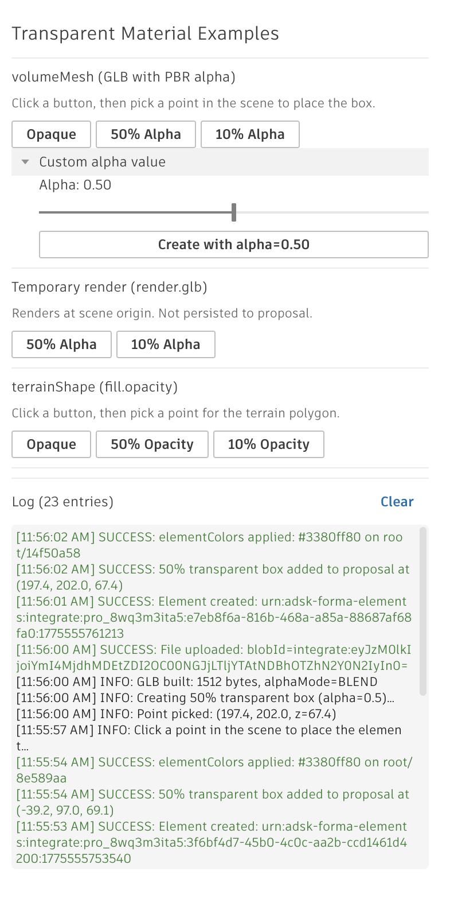

# Transparent Material Test Extension

A Forma Site Design embedded-view extension that investigates whether the `createElementV2` API supports transparent materials on `volumeMesh` elements.



## Background

A user reported that elements added to Forma via `createElementV2` always render opaque, even when the uploaded GLB contains PBR materials with `alphaMode: "BLEND"` and a translucent `baseColorFactor`. This extension was built to systematically test every transparency-capable path in the Forma SDK and identify a workaround.

## Findings

### volumeMesh ignores GLB material alpha

Forma's volumeMesh renderer discards GLB materials during geometry extraction. The loading pipeline extracts only positions, normals, and RGB colors from the GLB — the material object (including `alphaMode`, `baseColorFactor` alpha, `transparent`, and `opacity`) is thrown away. Even RGBA vertex colors are stripped to RGB.

This is an architectural limitation in the renderer, not a bug in the SDK or in how the GLB is constructed.

### Workaround: `elementColors` with `#RRGGBBAA` hex

`Forma.render.elementColors.set()` accepts 8-character hex colors (e.g. `#3380ff80` for 50% opacity blue). This bypasses the geometry extraction pipeline and applies color overrides at render time, switching the rendering spec to `vertexColorsTransparent` with `MeshLambertMaterial({ transparent: true })`.

The extension uses this as a post-hoc step after creating and placing the element:

```ts
const { path } = await Forma.proposal.addElement({ urn, transform });
const pathsToColor = new Map<string, string>();
pathsToColor.set(path, `#3380ff80`); // RRGGBBAA
await Forma.render.elementColors.set({ pathsToColor });
```

**Caveat**: `elementColors` overrides are temporary — they are cleaned up when the extension is closed and are not persisted to the proposal.

## What the extension tests

| Approach | Transparency | Persistent | Result |
|---|---|---|---|
| `volumeMesh` GLB with `alphaMode: "BLEND"` | No | Yes | Always opaque |
| `volumeMesh` + `elementColors` `#RRGGBBAA` | Yes | No (runtime only) | Works |
| `render.glb.add()` with PBR alpha | No | No | Always opaque |
| `terrainShape` with `fill.opacity` | Yes | Yes | Works (2D only) |

## Running locally

```bash
npm install
npm run dev
```

The extension renders a preview-mode UI at `http://localhost:5173/`. Buttons are disabled outside the Forma host since they require the embedded-view SDK.

## Tech stack

- Vite + React + TypeScript
- `forma-embedded-view-sdk` for Forma integration
- `@weave-mui/material` + `@weave-mui/styles` for Autodesk Weave UI Kit
